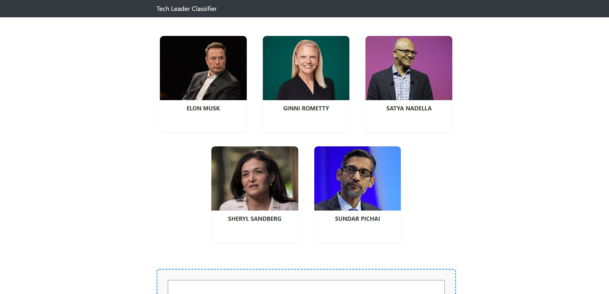

# Tech Leader Classifier

This project is at the intersection of data science and machine learning, where we delve into the fascinating world of tech leadership. Our goal is to classify images of prominent figures in the technology sector. For the scope of this project, classification is narrowed down to five influential tech CEOs:

- Elon Musk
- Ginni Rometty
- Satya Nadella
- Sheryl Sandberg
- Sundar Pichai

## Project Structure

- `UI/`: Contains the code for the user interface of the website.
- `server/`: Python Flask server for backend operations.
- `model/`: Includes the Jupyter notebook used for building the machine learning model.


## Technologies

This project harnesses a wide array of technologies across different aspects of development:

- **Data Cleaning and Preparation**: Utilizing `Numpy` and `OpenCV`.
- **Data Visualization**: Creating insightful visualizations with `Matplotlib` and `Seaborn`.
- **Model Building**: Employing `Sklearn` for crafting the machine learning model.
- **Development Environments**: Leveraging `Jupyter Notebook`, `Visual Studio Code`, and `PyCharm` as the primary IDEs.
- **Backend Server**: Developing a robust HTTP server with `Python Flask`.
- **Frontend Development**: Crafting the user interface using `HTML`, `CSS`, and `Javascript`.

## Getting Started

To get this project up and running on your local machine, follow these steps:

1. **Clone the Repository**
    ```bash
    git clone https://github.com/kunalch204/TechLeaderClassifer.git
    ```

2. **Set Up the Environment**
    It's recommended to use a virtual environment:
    ```bash
    python -m venv venv
    source venv/bin/activate  # On Windows, use `venv\Scripts\activate`
    ```

3. **Install Dependencies**
    Navigate to the project's model directory and install the required packages:
    ```bash
    pip install -r requirements.txt
    ```

4. **Run the Application**
    Start the Flask server and the UI as per the instructions in their respective directories.

## Contributing

I welcome contributions to this project! Whether it's improving the model, enhancing the UI, or fixing bugs, your input is valued. Please feel free to fork the repository, make your changes, and submit a pull request.
